# Step-By-Step Guide to install Data Library for Python Part 1

## Introduction

The Data Library is latest evolution of library that provides a set of ease-of-use interfaces offering coders uniform access to the breadth and depth of LSEG financial data and services. The [Data Library for Python](https://developers.lseg.com/en/api-catalog/lseg-data-platform/lseg-data-library-for-python) provides a set of ease-of-use interfaces offering coders uniform access to the breadth and depth of financial data and services available on the Workspace, RDP, and Real-Time Platforms via the Python programming language. The API is designed to provide consistent access through multiple access channels and target both Professional Developers and Financial Coders. Developers can choose to access content from the desktop, through their deployed streaming services, or directly to the cloud. With the Data Library, the same Python code can be used to retrieve data regardless of which access point you choose to connect to the platform.

This article provides a step-by-step guide to install the Python version of the Data library. I strongly recommend you read this article together with the [library Quick Start page](https://developers.lseg.com/en/api-catalog/lseg-data-platform/lseg-data-library-for-python/quick-start) to cover all basic knowledge that you need to use the library.

## Prerequisite 

### Python 

You need the [Python ](https://www.python.org/) programming language installed on your machine.

### Access to Python Package Repository

You need an access to Python Package Repository. The public repositories are [PyPI](https://pypi.org/), [Anaconda](https://anaconda.org/anaconda/repo), and [Conda-forge](https://anaconda.org/conda-forge/repo).

Some organization might deployed the Data Library for Python and other packages in their internal repository (example: LSEG), so you need to configure the Python and the Package Manager to connect to your internal repository. 

Please contact your local IT support to help you access your company internal repo.

## The Basic Rule

The basic rule is simple, ***do not install the Data Library for Python in the based or global Python installation***.

The reason is to avoid dependencies conflict between libraries requirements such as the following example.

```bash
A module that was compiled using NumPy 1.x cannot be run in
NumPy 2.0.2 as it may crash. To support both 1.x and 2.x
versions of NumPy, modules must be compiled with NumPy 2.0.
Some module may need to rebuild instead e.g. with 'pybind11>=2.12'.
 
If you are a user of the module, the easiest solution will be to
downgrade to 'numpy<2' or try to upgrade the affected module.
We expect that some modules will need time to support NumPy 2.
 
Traceback (most recent call last):  File "c:\python\LDP_Library\LDP_Library\Examples\tempCodeRunnerFile.py", line 3, in <module>
    import pandas as pd
```

This error message means the Python already has the NumPy library version 1.x (from other projects) installed. However, the Data Library for Python requires NumPy version 2 (**as of version 2.1.1**) which both version cannot be installed together.

How do we handle this dependencies conflict issue? We can use a **Python virtual environment** to solve the issue. A Python virtual environment is an isolated directory containing its own Python interpreter and a set of installed packages. This isolation prevents conflicts between dependencies of different Python projects and ensures project reproducibility.

I am demonstrating with the most popular Python virtual environment systems, the [venv](https://docs.python.org/3/library/venv.html) and [Anaconda](https://www.anaconda.com/)/[MiniConda](https://www.anaconda.com/docs/getting-started/miniconda/main).

The logic can be applied to the other Python virtual environment systems like [Pipenv](https://pipenv.pypa.io/en/latest/) or [Poetry](https://python-poetry.org/) too.

## Python venv Installation

Let’s start with the Python venv. The [Python venv](https://docs.python.org/3/library/venv.html) is a Python built-in module that lets developers create and manage Python virtual environment. The venv lets developers manage and install Python packages from [PyPI](https://pypi.org/) with a [pip tool](https://packaging.python.org/en/latest/tutorials/installing-packages/).

With the venv, a virtual environment always uses the same Python version as the based version.

It is recommend that **you create and use one virtual environment per one Python project**.

### Step 1: Create a new virtual environment

Open a command prompt application to the location that you need to store a virtual environment, then run the following command

```bash
$>python -m venv <virtual environment name>
```

Example: Creating a virtual environment name **ld211**.

```bash
$>python -m venv ld211
```

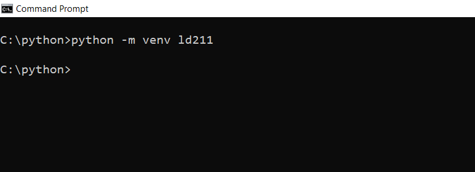

### Step 2: Activate a virtual environment

After a virtual environment is created succeed, you need to activate it to use a Python virtual environment.

Windows:

```bash
$><virtual environment name>\Scripts\activate
```

Linux and MacOS:

```bash
$>source .<virtual environment name>/bin/activate 
```

Once you are in a virtual environment, you see the **(virtual environment name)** at the front of the prompt as follows.

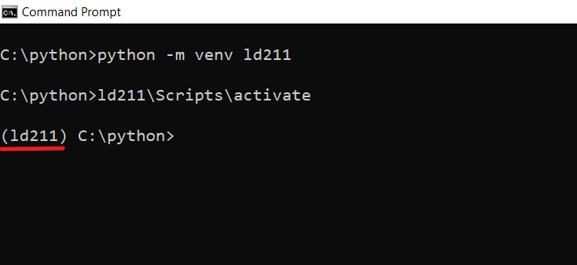

### Step 3: Install Python packages

**Note**: If your organization uses internal repository to store Python packages, please contact your local IT support to help you configure the pip system to access that repository first.

Now your newly created Python environment is ready for installing the packages. You can install the Data Library for Python with the following command

```bash
(venv name)$>pip install lseg-data
```

You can install multiple packages at the same time too.

```bash
(venv name)$>pip install lseg-data jupyterlab matplotlib 
```

**Note**: In some environment behind proxy, you might need the following command instead.

```bash
(venv name)$>pip install --trusted-host pypi.python.org --trusted-host files.pythonhosted.org --trusted-host pypi.org --no-cache-dir lseg-data
```

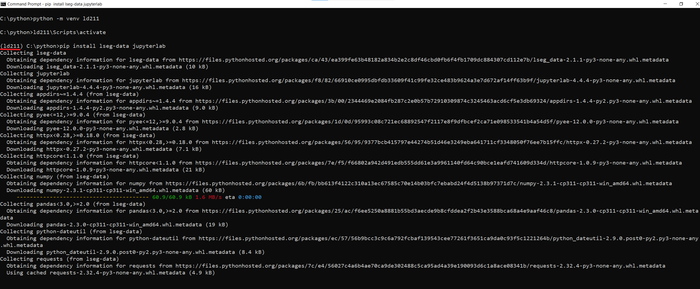

Once the packages installation is succeed, you can use the installed libraries and packages within an environment.

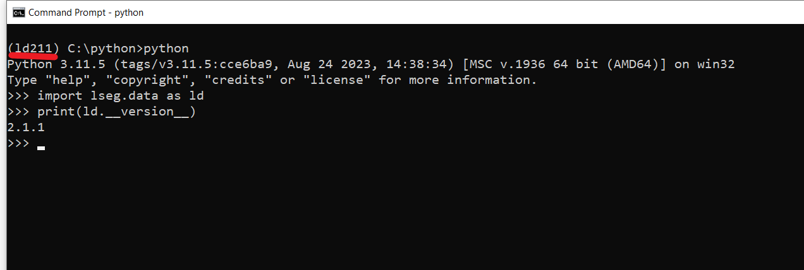


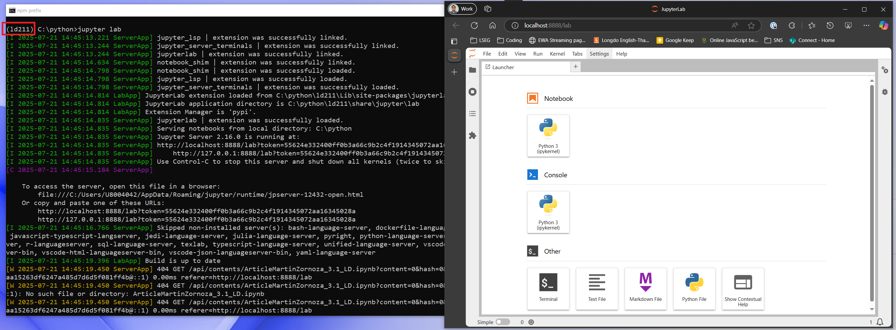

### Step 4: Create A Dependencies File

It is a good idea to create a list of Python dependencies after you have installed the required packages in a virtual environment. The file helps you and colleagues know which packages and its version that an environment needs to run a Python project. It also help to re-create an environment, and simplifies deployment and collaboration.

A default dependencies file format of [Python pip](https://pypi.org/project/pip/) is [requirements.txt](https://pip.pypa.io/en/stable/reference/requirements-file-format/) file. You can create a file with the following command:

```bash
(venv name)$>pip freeze > requirements.txt
```

If you open a requirements.txt file, you will be noticed that it is just a plain text file contain list of dependencies and version.

```ini
anyio==4.9.0
appdirs==1.4.4
argon2-cffi==25.1.0
argon2-cffi-bindings==21.2.0
arrow==1.3.0
asttokens==3.0.0
async-lru==2.0.5
attrs==25.3.0
babel==2.17.0
beautifulsoup4==4.13.4
bleach==6.2.0
certifi==2025.6.15
cffi==1.17.1
charset-normalizer==3.4.2
colorama==0.4.6
....
```

You can find more detail about a version specifier from the [Python packaging specification](https://packaging.python.org/en/latest/specifications/version-specifiers/#id5) document.

Then you can share this requirements.txt file to your peer or push it to a version control software, so other developers can replicate the same Python virtual environment.

To install the same set of dependencies, you can use the following command:

```bash
(venv name)$>pip install -r requirements.txt
```

Please be noticed that the file contains only set of Python packages information, so you need to create a new virtual environment manually and re-install the packages to replicate the same environment setting.

There are more resources about a requirements.txt file as follows:

- [The Python Requirements File and How to Create it](https://learnpython.com/blog/python-requirements-file/)
- [Use requirements.txt in PyCharm](https://www.jetbrains.com/help/pycharm/managing-dependencies.html)

### Step 5: Deactivate An Environment

After you have finished work on a Python project, you can exit a virtual environment with the following command.

```bash
(venv name)$>deactivate

$>
```

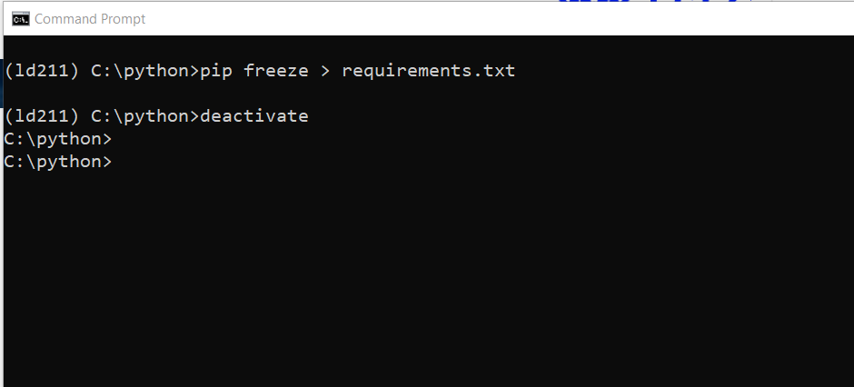

This helps your prompt back to a base environment (default Python environment), so you can activate other Python virtual environment to work on other projects.

That is all I have to said about Python venv.

## Python Anaconda/Miniconda Installation with Anaconda Prompt

Now let me turn to [Anaconda](https://www.anaconda.com/docs/getting-started/anaconda/main)/[Miniconda](https://www.anaconda.com/docs/getting-started/miniconda/main) virtual environment.

Anaconda is an open source Python and R distribution, package and environment management tool that is focusing on data science and scientific programming. Anaconda comes with [Conda](https://docs.conda.io/projects/conda/en/latest/user-guide/getting-started.html#managing-python) package and environment management tool with its own [Anaconda](https://anaconda.org/anaconda/repo) and [Conda-Forge](https://anaconda.org/conda-forge/repo) Python packages repositories. 

Miniconda is also a lightweight distribution of the Conda package and environment manager. It provides minimal set up and few essential packages bundled for developers when comparing with Anaconda. It can access Anaconda and Conda-Forge packages repositories as same as Anaconda.

**Note**: 
- Both Anaconda and Miniconda come with a Python pip tool, so they can use pip tool and access PyPI repository.
- I am going to refer a Python virtual environment created by Conda as *Conda virtual environment*.

With Conda, you can a Python virtual environment in various version of Python.

To learn more about Anaconda/Miniconda vs venv, please refer to the following resources

- [Understanding Python Environment Management: venv vs conda](https://python.plainenglish.io/understanding-python-environment-management-venv-vs-conda-c4884ebbbe5e)
- [Choosing Between venv and conda virtual environments](https://vinayak-hegde.medium.com/choosing-between-venv-and-conda-fc60fcc89712)
- [venv vs Anaconda: Choosing the Right Tool for Creating Virtual Environments in Python](https://saturncloud.io/blog/venv-vs-anaconda-choosing-the-right-tool-for-creating-virtual-environments-in-python/)

Please note that it is highly recommended to **create and use one Conda environment per Python project**.

### Step 1: Create a new Conda virtual environment

Open a Anaconda prompt application, then run the following command

```bash
(base)$>conda create --name <virtual environment name> python=<python version>
```

Example: Creating a Conda environment name **ld_python** with Python version 3.12.

```bash
(base)$>conda create --name ld_python python=3.12
```

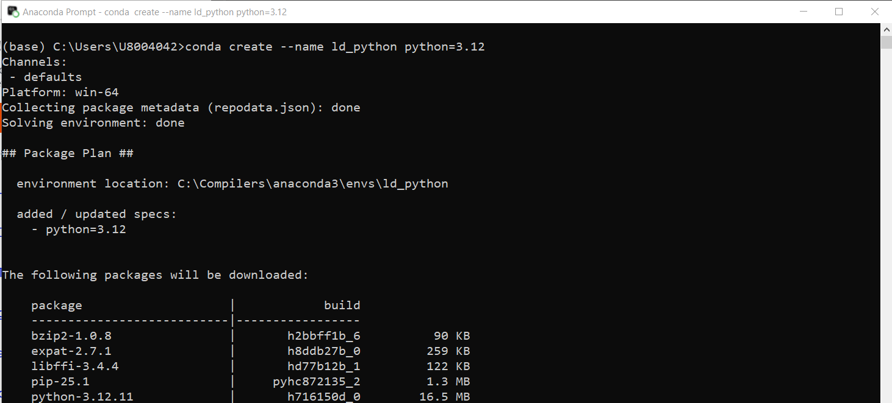

Then you just confirm additional packages download for creating an environment.

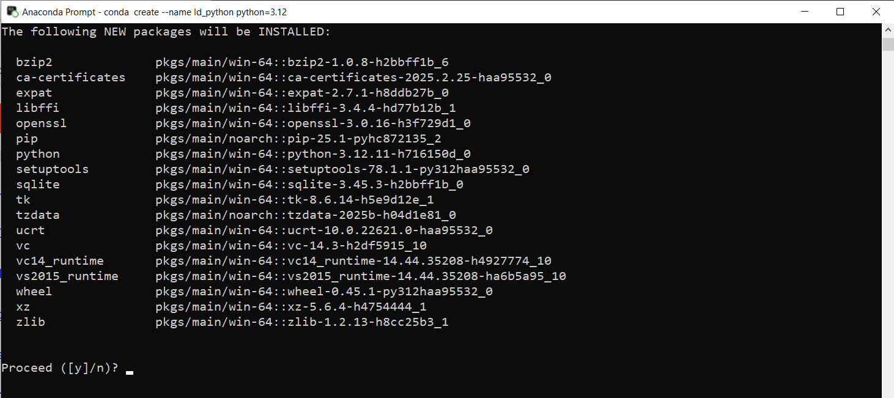

### Step 2: Activate a virtual environment

After a Conda virtual environment creation is succeed, you see a following screen:

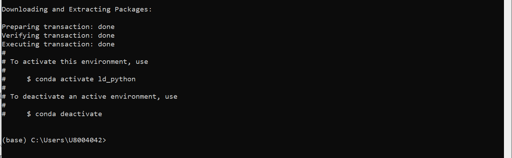

To access a Conda environment, you need to activate it with the following command.

```bash
(base)$>conda activate <virtual environment name>
```

Example

```bash
(base)$>conda activate ld_python
```

Once you are in a Conda virtual environment, you see the **(Conda environment name)** at the front of the prompt as follows.

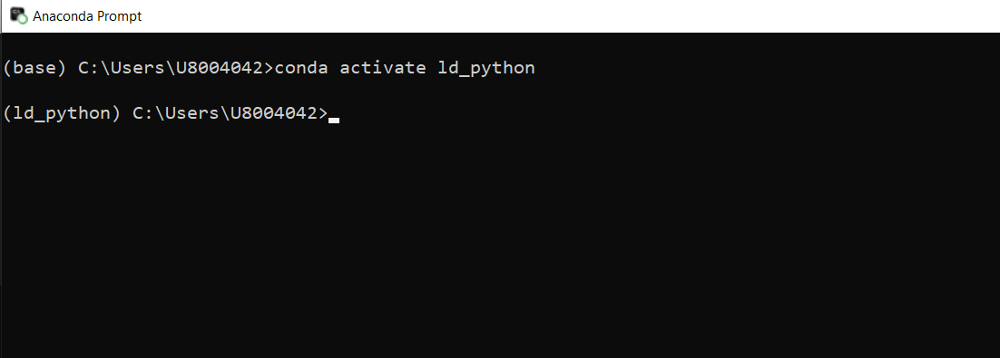

### Step 3: Install Data Library for Python with Pip

**Note**: If your organization uses internal repository to store Python packages, please contact your local IT support to help you configure the pip system to access that repository first.

Now your newly created Conda environment is ready for installing the packages. The Data Library for Python is **available on the PyPI repository only**, so you need to install the Data Library for Python with a *pip install* command (like the steps above).

```bash
(ld_python)$>pip install lseg-data
```

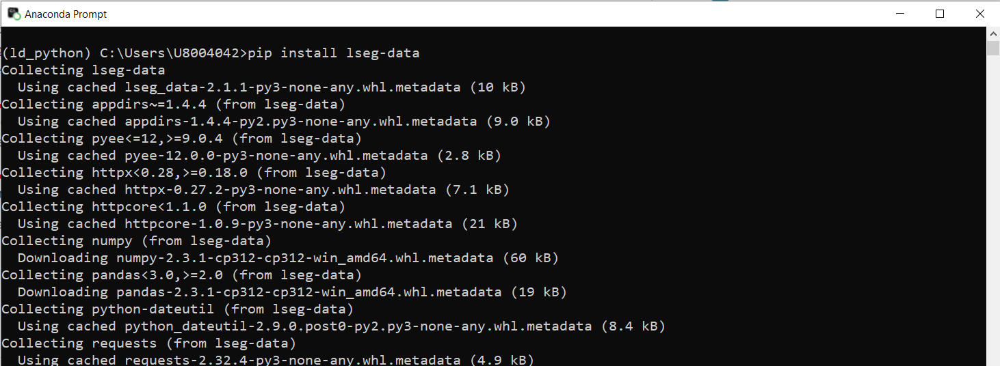

Once the library has been installed, you can use the Data Library within this Python virtual environment.

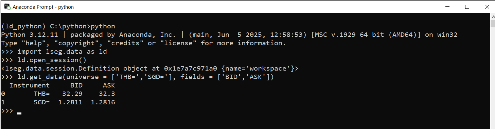

However, just a single Data Library might not enough for your Python project. 

### Step 4: Install Other Packages with Conda

That brings us to the next step, install other required libraries for the Python project.  Conda supports two Python packages repositories, the [Anaconda](https://anaconda.org/anaconda/repo) and [Conda-Forge](https://anaconda.org/conda-forge/repo) repositories. I strongly recommend you check library website to verify which one that contains your required packages.

Please note that you can choose to stick with pip and PyPI tools in your Conda environment for other packages.

To install Python packages with Conda, you can run the following command on an activate environment.

Python packages from [Anaconda repo](https://anaconda.org/anaconda/).

```bash
(venv name)$>conda install anaconda::<package name>
```
Python packages from [Conda-Forge repo](https://anaconda.org/conda-forge).

```bash
(venv name)$>conda install conda-forge::<package name>
```

Example: Installing Jupyter Lab and Plotly 

```bash
(ld_python)$>conda install conda-forge::jupyterlab conda-forge::plotly
```

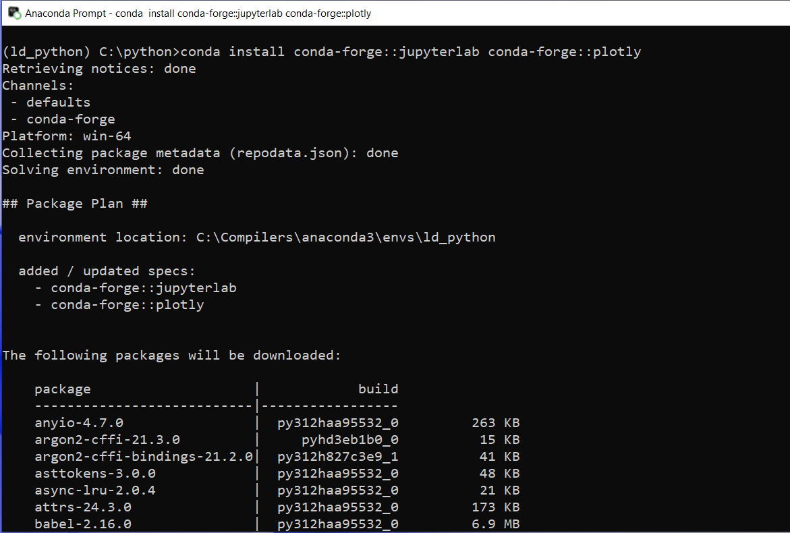

Once the installation is finished, you can start a Jupyter Lab application and create a Notebook application that uses the Data Library and Plotly.

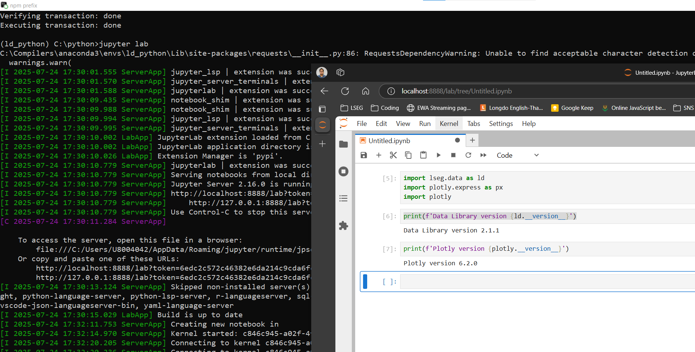

### Step 4: Create A Backup Environment File

It is a good idea to create a list of Python dependencies after you have installed the required packages in a virtual environment. The file helps you and colleagues know which packages and its version that an environment needs to run a Python project. It also help to re-create an environment, and simplifies deployment and collaboration.

A default dependencies file of Conda is in [YAML](https://yaml.org/) file. You can create a file with the following command on an active environment.

```bash
(venv name)$>conda env export > environment.yml
```

Or if you are aiming for a cross-platform compatibility, use the following command.

```bash
(venv name)$>conda env export --no-builds > environment.yml
```

Example:

```bash
(ld_python)$>conda env export > ld_environment.yml
```

If you open a ld_environment.yml file, you will be noticed that it is just a plain text file in YAML format (check on [What is YAML? Understanding the Basics, Syntax, and Use Cases](https://www.datacamp.com/blog/what-is-yaml) article to learn more about YAML).

```yaml
name: ld_python
channels:
  - conda-forge
  - defaults
  - https://repo.anaconda.com/pkgs/main
  - https://repo.anaconda.com/pkgs/r
  - https://repo.anaconda.com/pkgs/msys2
dependencies:
  - argon2-cffi=21.3.0
  - argon2-cffi-bindings=21.2.0
  - asttokens=3.0.0
  - async-lru=2.0.4
  - ...
  - zlib=1.2.13
  - pip:
      - anyio==4.9.0
      - appdirs==1.4.4
      ...
prefix: C:\Compilers\anaconda3\envs\ld_python
```

You may be noticed that an environment file contains both virtual environment detail and dependencies information. The reason is this **environment.yml file supports entire Conda virtual environment re-creation (both environment and dependencies, including Conda and PyPI packages)**. Unlike the pip tool and PyPI that supports only Python PyPI packages restoration.

To re-create the same environment with the same set of Python packages, you can run the following command **on the base environment**.

```bash
(bash)$>conda env create -f environment.yml
```

Please note that if you have installed all packages with a pip tool, you can use just a *pip freeze* command to create a *requirements.txt* file to track a dependencies only.

### Step 5: Deactivate An Environment

After you have finished work on a Python project, you can exit a Conda virtual environment with the following command.

```bash
(venv name)$>conda deactivate

(base)$>
```

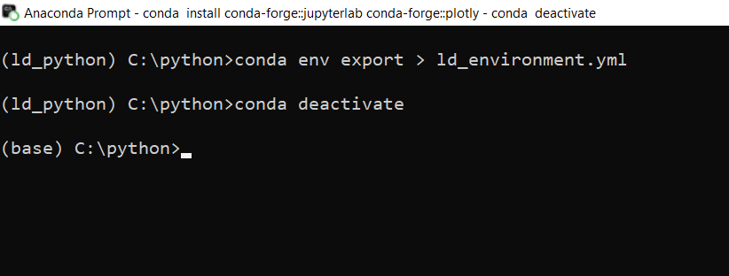

This help your prompt back to a base environment (default Conda environment), so you can activate other Python virtual environment to work on other projects.

That covers Conda environment creation with Anaconda Prompt.

To learn more about Conda environment management with Anaconda Prompt, please refer to the following resources:

- [Conda: Managing environments](https://docs.conda.io/projects/conda/en/latest/user-guide/tasks/manage-environments.html)
- [Anaconda Environments](https://www.anaconda.com/docs/tools/working-with-conda/environments)
- [Getting started with conda](https://docs.conda.io/projects/conda/en/latest/user-guide/getting-started.html#managing-python)


## Python Anaconda/Miniconda Installation with Anaconda Navigator

So, now let’s look at another way to interact with Conda. Some developers might feel comfortable to interact with Anaconda via the [Anaconda Navigator](https://www.anaconda.com/docs/tools/anaconda-navigator/main) application. Anaconda Navigator is a desktop application allows developers to manage Conda environments, Python packages, and launch application. 

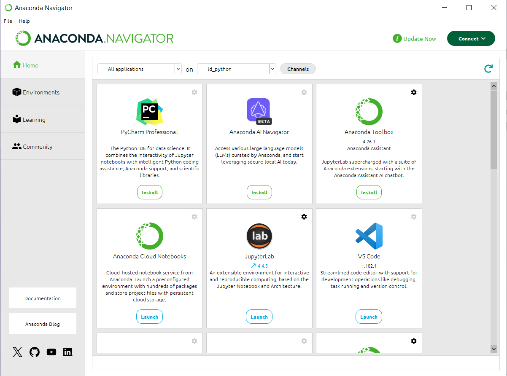

### Step 1: Create a new Conda virtual environment

Open a Anaconda Navigator application, then click on the **Environments** tab. You will see a list of available Conda environments and their installed packages.

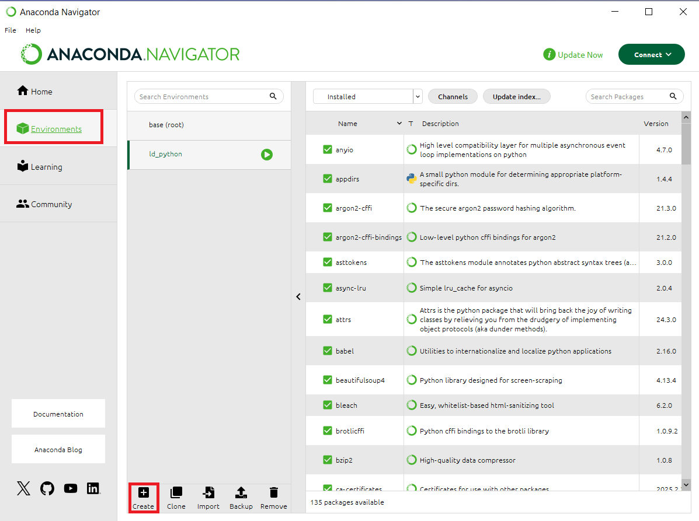

You can manage Conda environments on this tab. To create a new Conda environment, click on the **Create** button.

The next step is input Conda environment name, check on Python package and select a Python version.

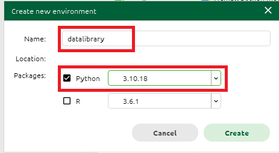

And then waiting for an environment creation process.

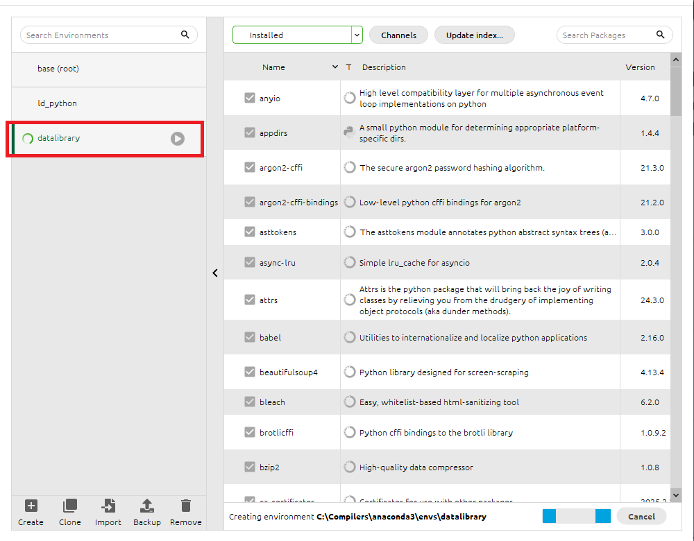

### Step 2: Install Data Library for Python with Pip

Unfortunately, the Anaconda Navigator cannot manage PyPI packages. It mean you **cannot install LSEG Data Library (and other PyPI packages) with the Anaconda Navigator**. To install the Data Library (which is available on PyPI repository only), you can activate this newly created Conda environment on **Anaconda Prompt** application and install the Data Library package there.

Open a Anaconda prompt application, then run the following command to activate a Conda environment.

```bash
(base)$>conda activate datalibrary
```

Then install the Data Library package with Python Pip tool.

```bash
(datalibrary)$>pip install lseg-data
```

Please be noticed that you are in the Conda environment, not the based environment.

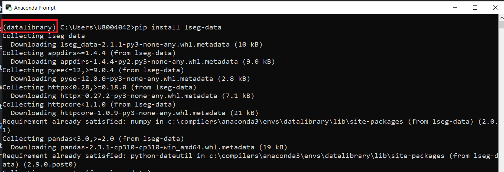

### Step 4: Install Other Packages with Conda

That brings us to the next step, install other required libraries for the Python project.  You can install the Python packages from Conda or Conda-Forge repositories via Anaconda Navigator's Environments tab.

To install Conda packages, select an environment, choose **Not installed**, and then input the package name on the top-right corner textbox.

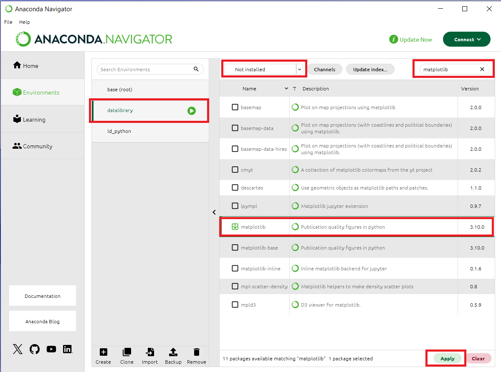

Select the package that you need and then click the Apply button.

Please click on the Apply button when there is a pop up window to confirm related packages.

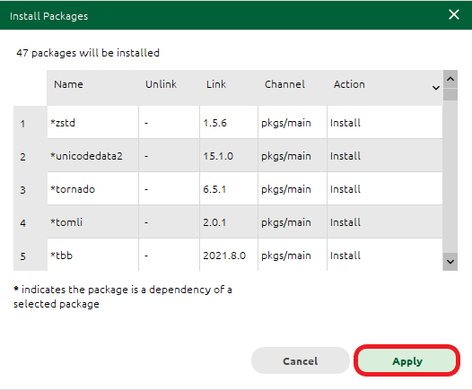

To check on the installed packages, you can just select **installed** on the list.

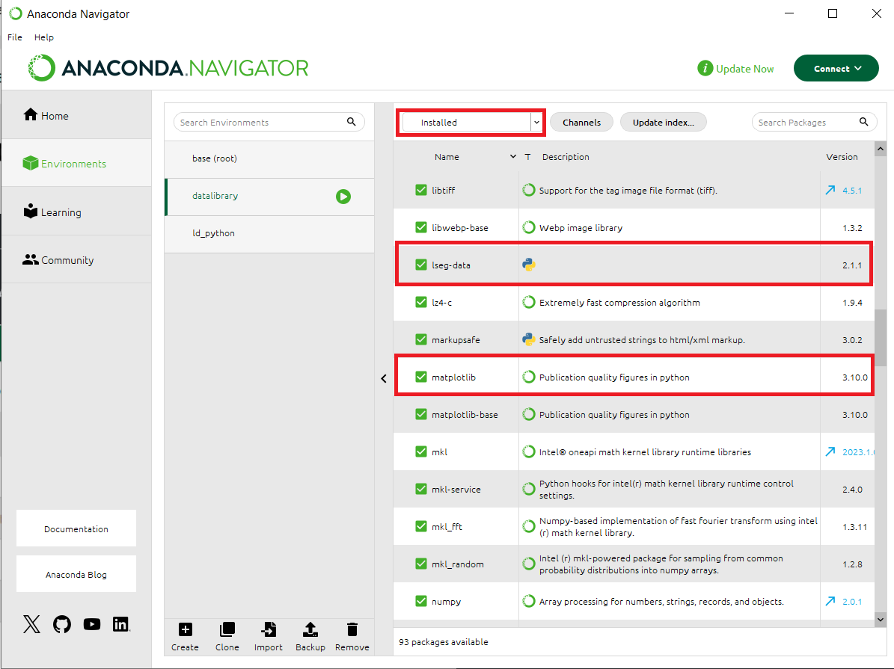

That is all I have to say about how to install Python packages on the Anaconda Navigator.

### Step 4: Create A Backup Environment File

My next point is how to create a backup environment file (in [YAML](https://yaml.org/) format) via the Anaconda Navigator. Stay on the Environments tab, click on the **Backup** button.

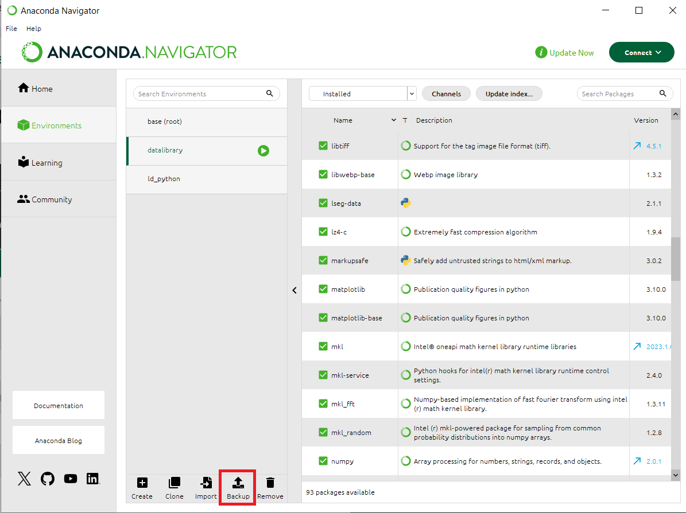

The Backup Environment popup window will show on the screen. You can select either backup a file on your local machine or on Anaconda cloud (Anaconda account requires). I am demonstrating with a local drive.

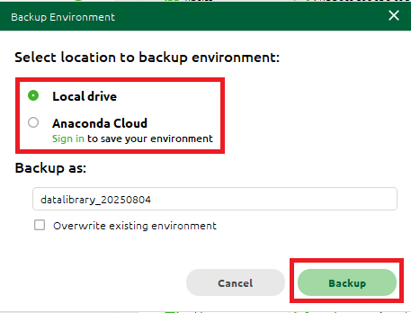

Then click on the Backup button. 

The next step is to select a backup file location and name.

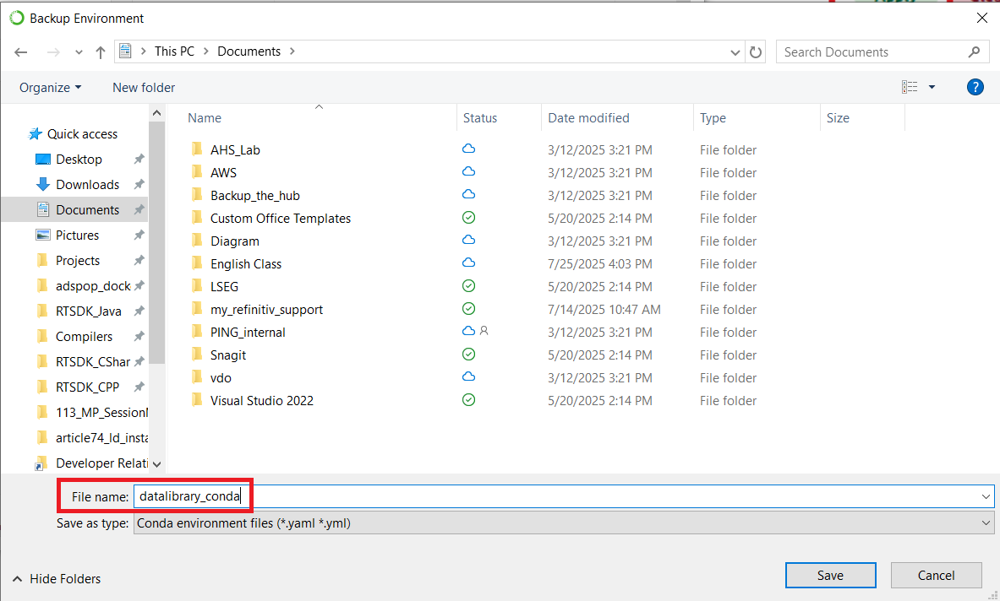

Once the backup process is succeed, you will see a confirmation message as follows.

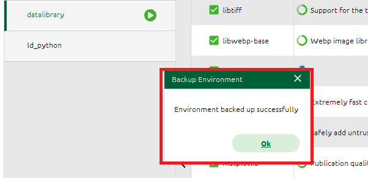

To restore a Conda environment with the same set of Python packages, you can use Anaconda Prompt or click on the **Import** button on the Anaconda Navigator's Environments tab.

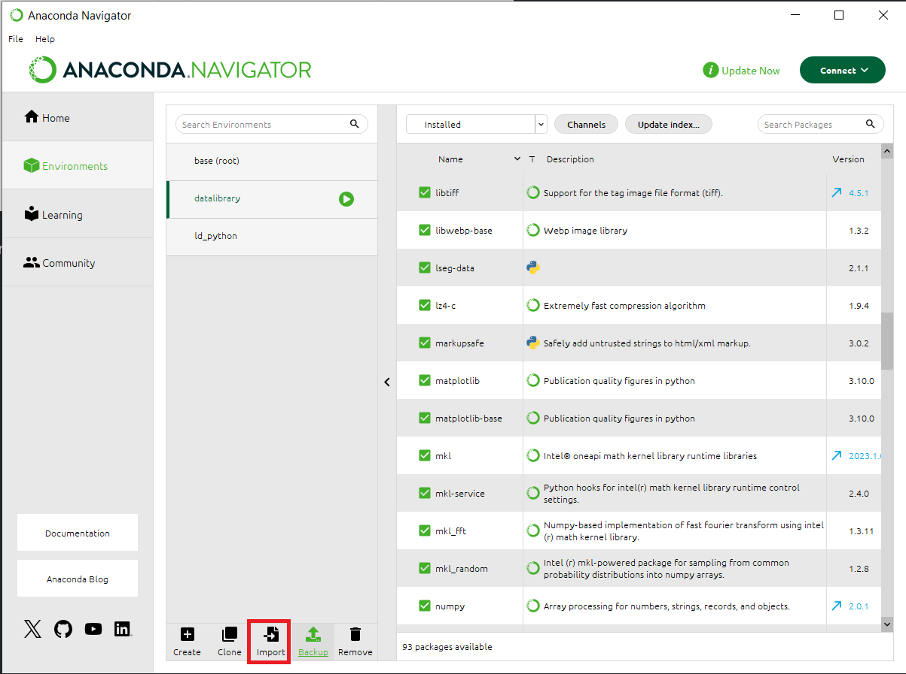

That covers how to manage Conda environment using Anaconda Navigator.

## Come with the Repository

- **requirements.txt**: Python venv dependencies file
- **environment.yml**: Conda environment dependencies file (please change the ```prefix``` setting to match your environment)
- **example_notebook.ipynb**: Example Jupyter Notebook file for verifying you have installed Data Library successfully
- **lseg-data.config.json**: Data Library configuration file

## Troubleshooting

**Question 1**: I got **SSLCertVerificationError** message when I try *pip install lseg-data* command.

```bash
WARNING: Retrying (Retry(total=0, connect=None, read=None, redirect=None, status=None)) after connection broken by 'SSLError(SSLCertVerificationError(1, '[SSL: CERTIFICATE_VERIFY_FAILED] certificate verify failed: unable to get local issuer certificate (_ssl.c:1006)'))': /simple/lseg-data/
Could not fetch URL https://pypi.org/simple/lseg-data/: There was a problem confirming the ssl certificate: HTTPSConnectionPool(host='pypi.org', port=443): Max retries exceeded with url: /simple/lseg-data/ (Caused by SSLError(SSLCertVerificationError(1, '[SSL: CERTIFICATE_VERIFY_FAILED] certificate verify failed: unable 
to get local issuer certificate (_ssl.c:1006)'))) - skipping
```

**Answer**: The error indicates that your machine could not connect to PyPI repository website due to SSL certificate verification. The possible root cause can be as follows:

- Missing or outdated CA certificates on your machine
- Your organization's firewall or proxy interrupts the SSL verification process
- etc. 

You can try to install the Data Library with the following command.

```bash
(venv name)$>pip install --trusted-host pypi.python.org --trusted-host files.pythonhosted.org --trusted-host pypi.org --no-cache-dir lseg-data
```

If the command above does not help, please contact your local network support team to help you with this connection issue.

**Note**: If your organization uses internal repository to store Python packages (like DX One for LSEG staff), please contact your local IT support to help you configure the pip system to access that repository first.

**Question 2**: I got **pip command not found** or **'pip' is not recognized...** error message when I try *pip install lseg-data* command.

Error On Windows:

```bash
'pip' is not recognized as an internal or external command,
operable program or batch file.
```
Error On Mac:

```bash
zsh: command not found: pip
```

**Answer**: The error indicates that the pip tool or Python did not installed correctly on your machine, or added to the system PATH. The pip tool is included with the Python installation, you must add the path of your pip installation to your PATH system variable.

- [For Windows, see this StackOverFlow post](https://stackoverflow.com/questions/23708898/pip-is-not-recognized-as-an-internal-or-external-command)
- [For Mac, see this guide](https://mac.install.guide/python/command-not-found-pip)

## <a id="references"></a>References

You can find more detail regarding the Data Library from the following resources:

- [LSEG Data Library for Python](https://developers.lseg.com/en/api-catalog/lseg-data-platform/lseg-data-library-for-python) on the [LSEG Developer Community](https://developers.lseg.com/) website.
- [Data Library for Python - Reference Guide](https://developers.lseg.com/en/api-catalog/lseg-data-platform/lseg-data-library-for-python/documentation#reference-guide)
- [The Data Library for Python  - Quick Reference Guide (Access layer)](https://developers.lseg.com/en/article-catalog/article/the-data-library-for-python-quick-reference-guide-access-layer) article.
- [Essential Guide to the Data Libraries - Generations of Python library (EDAPI, RDP, RD, LD)](https://developers.lseg.com/en/article-catalog/article/essential-guide-to-the-data-libraries) article.
- [Upgrade from using Eikon Data API to the Data library](https://developers.lseg.com/en/article-catalog/article/Upgrade-from-using-Eikon-Data-API-to-the-Data-library) article.
- [Data Library for Python Examples on GitHub](https://github.com/LSEG-API-Samples/Example.DataLibrary.Python) repository.

For any question related to this example or Data Library, please use the Developers Community [Q&A Forum](https://community.developers.refinitiv.com).